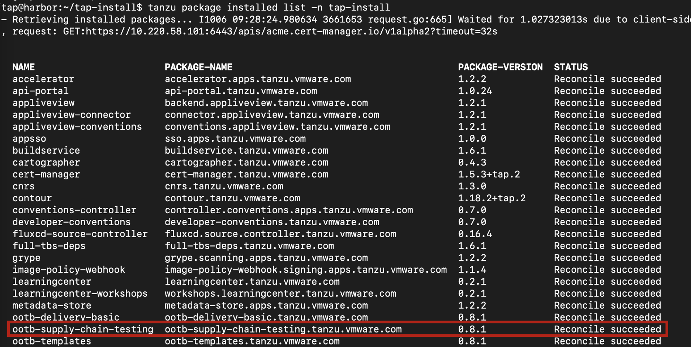
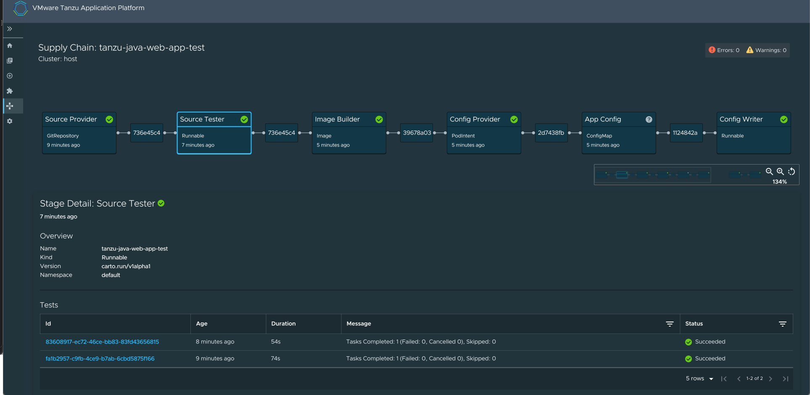
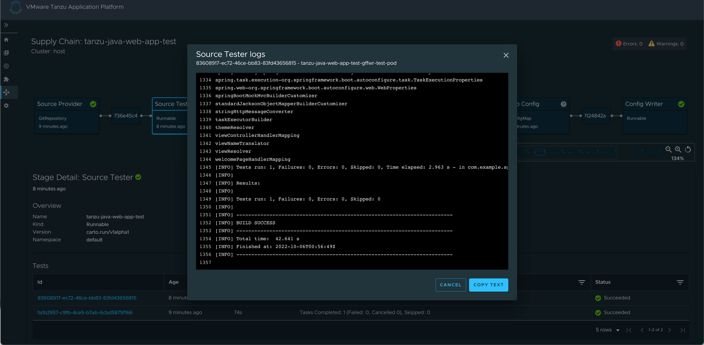
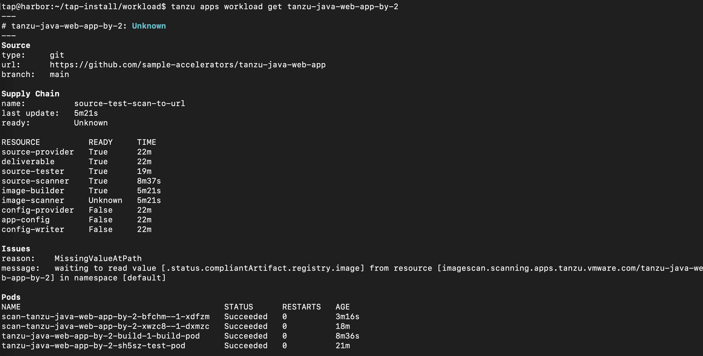
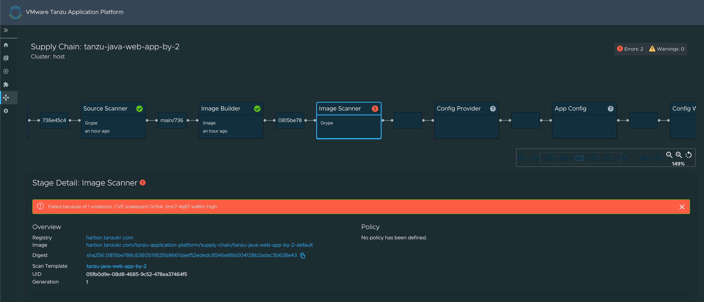

# OOTB Supply Chain

본 과정에서는 TAP (Tanzu Application Platform)의 OOTB Supply Chain을 basic에서 testing 및 testing_and_scanning으로 변경하는 방법에 대해 알아보겠습니다.

* OOTB Supply Chain - Testing을 설치합니다.
* 클러스터에 Tekton 파이프라인을 추가하고, 파이프라인을 가리키도록 워크로드를 업데이트 하여 오류를 해결합니다.
* OOTB Supply Chain - Testing and Scanning을 설치합니다.
* 취약점 및 종속성을 쿼리합니다.
* [참고 링크](https://docs.vmware.com/en/VMware-Tanzu-Application-Platform/1.2/tap/GUID-getting-started-add-test-and-security.html)

## 1.OOTB Supply Chain - Testing 

### 1) tap-values.yaml 변경

tap-values.yaml 에서 supply chain에 대한 정보가 있는 Line을 다음과 같이 업데이트합니다.
~~~
- supply_chain: basic
+ supply_chain: testing

- ootb_supply_chain_basic:
+ ootb_supply_chain_testing:
    registry:
      server: "SERVER-NAME"
      repository: "REPO-NAME"
~~~

변경된 프로필로 패키지를 업데이트합니다.
~~~
tanzu package installed update tap -p tap.tanzu.vmware.com -v 1.2.1 --values-file tap-values.yaml -n tap-install
~~~

패키지가 적용되었는지 다음 명령어를 통해 확인합니다.
~~~
tanzu package installed list -n tap-install
~~~

아래와 같이 ootb-supply-chain-testing이 적용되었음을 확인합니다.

### 2) Tekton Pipeline 설정

다음 단계로는 Tekton Pipeline을 업데이트 합니다. 예시 yaml은 Jumpbox의 ~/tap-install/supplychain_test_scanning/tekton_pipeline.yaml 혹은 [링크](../install/tekton_pipeline.yaml) 에서 확인 가능합니다. 해당 Yaml 파일을 적용합니다.

~~~
kubectl apply -f tekton_pipeline.yaml)
~~~

yaml 파일에 정의된 step을 통해 개발자 워크로드에 표시된 repository 에서 코드를 가져오고 repository 내에서 테스트를 실행합니다. Tekton 파이프라인의 단계는 구성 변경이 가능하며 개발자가 코드를 테스트하는 데 필요한 추가 항목을 추가할 수 있습니다.

### 3) 애플리케이션 배포

다음 단계로는 워크로드를 새로운 supply chain과 연결 해야 합니다. 다음 명령어를 통해 수행합니다.

~~~
tanzu apps workload create tanzu-java-web-app \
  --git-repo https://github.com/sample-accelerators/tanzu-java-web-app \
  --git-branch main \
  --type web \
  --label app.kubernetes.io/part-of=tanzu-java-web-app \
  --label apps.tanzu.vmware.com/has-tests=true \
  --yes \
  --namespace default
~~~

배포가 끝난 후 tanzu apps workload get 명령어로 조회하면 이전과 다르게 Resource에 source-tester가 추가되었으며 pod에도 test-pod가 succeed 되었음을 확인 가능합니다.

GUI로 이동해 Supply Chain을 확인합니다.

각 테스트의 id를 클릭해 detail 정보를 확인할 수 있습니다.

## 2.OOTB Supply Chain - Testing and Scanning
### 1) 패키지 설치 확인

OOTB Testing and Scanning 을 설치하기 위해서는 먼저 scan controller와 grype 스캐너가 설치되었는지 확인이 필요합니다. 다음 명령어를 통해 확인합니다.
~~~
tanzu package installed get scanning -n tap-install
tanzu package installed get grype -n tap-install
~~~

설치되지 않았을 경우, [다음 링크](https://docs.vmware.com/en/VMware-Tanzu-Application-Platform/1.2/tap/GUID-scst-scan-install-scst-scan.html)를 참고해 설치를 진행 후 다음 단계로 넘어갑니다.

### 2) ScanPolicy
ScanPolicy는 아래의 템플릿을 이용하여 설치합니다. 해당 탬플릿의 경우 notAllowedSeverities := ["Critical","High","UnknownSeverity"]를 사용하여 중요, 높음 및 알 수 없는 등급의 CVE가 발견된 경우 Supply Chain을 타단합니다.  
ScanPolicy 템플릿은 Jumpbox의 ~/tap-install/supplychain_test_scanning 혹은 [여기](../install/scanpolicy.yaml)에서 확인할 수 있습니다.

~~~
kubectl apply -f scanpolicy.yaml
~~~

### 3) tap-values.yaml 변경
tap-values.yaml 에서 supply chain에 대한 정보가 있는 Line을 다음과 같이 업데이트합니다.
~~~
- supply_chain: testing
+ supply_chain: testing_scanning

- ootb_supply_chain_testing:
+ ootb_supply_chain_testing_scanning:
    registry:
      server: "<SERVER-NAME>"
      repository: "<REPO-NAME>"
~~~

설정한 profile로 tap 패키지를 업데이트합니다.
~~~
tanzu package installed update tap -p tap.tanzu.vmware.com -v 1.2.1 --values-file tap-values.yaml -n tap-install
~~~

패키지가 적용되었는지 다음 명령어를 통해 확인합니다.

~~~
tanzu package installed list -n tap-install
~~~

아래와 같이 ootb-supply-chain-testing이 적용되었음을 확인합니다.

### 4) Grype overlay 적용
실습 환경은 custom CA를 사용하기 때문에 Grype scanner를 사용하기 위한 추가적인 설정이 필요합니다.  
먼저 tap-values.yaml에 다음 코드를 추가합니다.

~~~
package_overlays:
  - name: "grype"
    secrets:
      - name: "grype-offline"
~~~

Jumpbox의 ~/tap-install/supplychain_test_scanning/grype/patch.yaml 파일 중 GRYPE_DB_UPDATE_URL 항목을 아래와 같이 수정합니다.
~~~
- name: GRYPE_DB_UPDATE_URL
  value: https://toolbox-data.anchore.io/grype/databases/listing.json
~~~

수정된 파일을 적용합니다. 
~~~
kubectl apply -f patch.yaml
~~~

다음 명령어를 실행해 annotate를 추가합니다.

~~~
kubectl annotate pkgi tap ext.packaging.carvel.dev/ytt-paths-from-secret-name.1=grype-offline -n tap-install
~~~

### 5) 애플리케이션 배포
다음 단계로는 워크로드를 새로운 supply chain과 연결 해야 합니다. 다음 명령어를 통해 수행합니다.

~~~
tanzu apps workload create tanzu-java-web-app \
  --git-repo https://github.com/sample-accelerators/tanzu-java-web-app \
  --git-branch main \
  --type web \
  --label app.kubernetes.io/part-of=tanzu-java-web-app \
  --label apps.tanzu.vmware.com/has-tests=true \
  --yes \
  --namespace default
~~~

tanzu apps workload get 명령어로 조회하면 이전과 다르게 Resource에 source-scanner 및 image-scanner가 추가되었으며 pod도 마찬가지로 2개 추가 (source 및 image 스캔용) 되었음을 확인 가능합니다.

GUI로 이동해 Supply Chain을 확인합니다. 만약 violation이 발견되었다면 아래 사진과 같이 표시됩니다.

