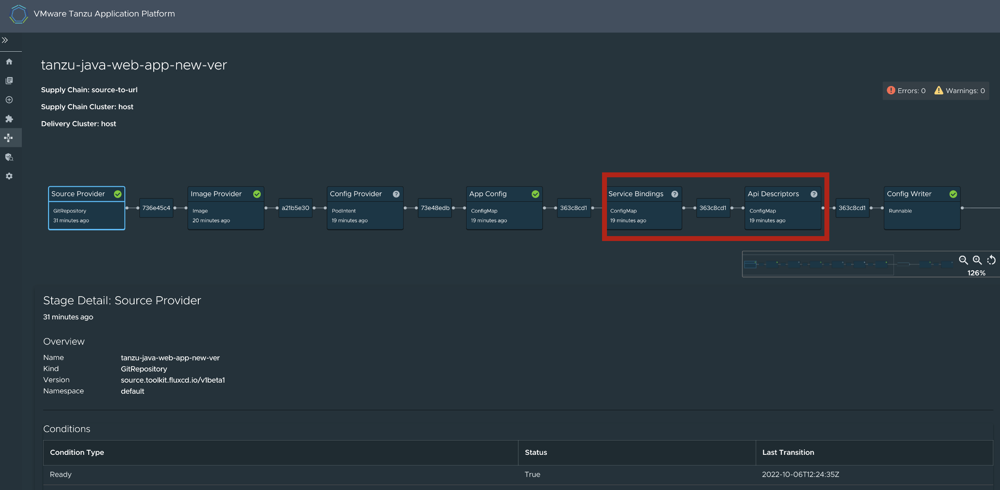
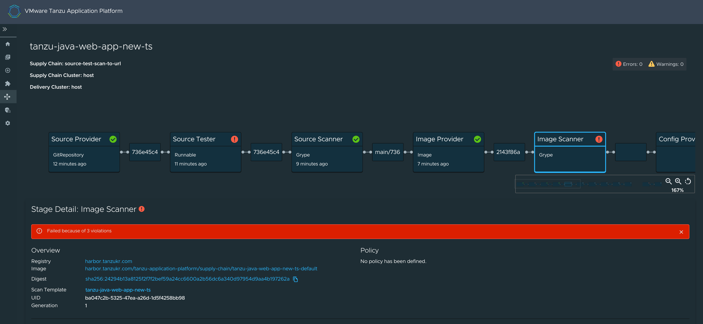
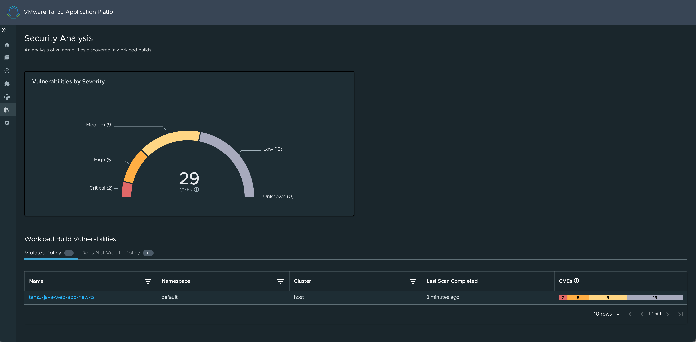

# Upgrade

본 과정에서는 TAP (Tanzu Application Platform)의 버전을 업그래이드 합니다. 현재 설치된 버전은 v1.2.1이며, v1.3.0-rc.1으로 업그레이드를 진행합니다.


## 1.파일 다운받기
Teams > General > tap1.3.0의 두 파일을 모두 다운로드 받습니다.

## 2. 레지스트리 로그인
점프박스 VM에서 다음의 레지스트리에 로그인을 합니다. 

### 1) 하버 레파지토리 웹 페이지 접속
```
https://harbor.tanzukr.com
```

### 2) TAP 설치 이미지를 저장할 사설 레지스트리 로그인
```
docker login harbor.tanzukr.com
```

## 3. 사설 레지스트리에 이미지 복사
다음 명령어를 사용하여 점프박스 VM에 파일로 저장된 이미지를 사설 레지스트리(여기서는 하버 레파지토리)로 복사합니다. 
```
imgpkg copy --tar tap-packages-1.3.0-rc.1.tar --to-repo harbor.tanzukr.com/tanzu-application-platform/tap-packages --include-non-distributable-layers --registry-verify-certs=false
```
> **_NOTE:_** 사설 인증서로 인증된 사설 레지스트리를 사용하는 경우 registry-verify-certs 옵션을 사용하여 레지스트리 인증을 생략할 수도 있습니다.

빌드 서비스 디펜던시를 위한 이미지도 복사합니다.
```
imgpkg copy --tar full-tbs-deps-package-repo-1.7.2.tar --to-repo harbor.tanzukr.com/tanzu-application-platform/full-tbs-deps-package-repo --include-non-distributable-layers  --registry-verify-certs=false
```

## 4. TAP package repository 업데이트
타겟 버전으로 package repository를 업데이트합니다.
~~~
tanzu package repository add tanzu-tap-repository \
--url harbor.tanzukr.com/tanzu-application-platform/tap-packages:1.3.0-rc.1 \
--namespace tap-install
~~~

새로운 package repository가 잘 설치되었는지 검증합니다. 아래 명령어를 실행했을 때 Reconcile Succeeded가 나오면 다음 단계로 넘어갑니다.
~~~
tanzu package repository get tanzu-tap-repository --namespace tap-install
~~~

## 5. Upgrade
Tanzu Application Platform은 설치할 때 수행했던 profile (tap-values.yaml)을 기반으로 업그레이드됩니다. 아래의 명령어를 실행합니다.

~~~
tanzu package installed update tap -p tap.tanzu.vmware.com -v 1.3.0-rc.1 --values-file test-tap-values.yaml -n tap-install
~~~

시간이 다소 소요되며, 업그레이드 후 다음 명령어로 검증합니다.
~~~
tanzu package installed list --namespace tap-install
~~~

수행 시 cnrs 및 tap 패키지의 경우 reconcile failed 메시지가 확인됩니다. 이는 tap가 1.3버전으로 업그레이드되면서 cnr 관련 config 일부가 deprecate 되었기 때문입니다. <br/>
tap-values.yaml에서 다음 부분을 삭제합니다.
~~~
cnrs:
  domain_name: tanzukr.com
  ingress:
    reuse_crds: true <- 해당 줄 삭제
    external:
      namespace: tanzu-system-ingress
~~~

이후 패키지를 업데이트합니다.
~~~
tanzu package installed update tap -p tap.tanzu.vmware.com -v 1.3.0-rc.1 --values-file test-scan-tap-values.yaml -n tap-install
~~~

아래 캡쳐와 같이 cnrs 및 tap가 정상적으로 설치되었음을 확인 후 다음 단계로 넘어갑니다.


## 6. 워크로드 배포 및 변경사항 확인
Tanzu Application Platform 1.3버전에는 몇 가지 추가 요소가 있습니다. UI에서 조금 더 자세한 확인을 위해 워크로드를 배포해 보겠습니다. <br/>
아래 워크로드는 supply chain basic 기준입니다.
~~~
tanzu apps workload create tanzu-java-web-app-new-ver \
   --git-repo https://github.com/sample-accelerators/tanzu-java-web-app \
   --git-branch main \
   --type web \
   --label app.kubernetes.io/part-of=tanzu-java-web-app \
   --yes \
   --namespace default
~~~

배포 후 GUI의 Supply Chain을 보면 아래 사진과 같이 service binding 및 api descriptor 정보가 supply chain에 추가되었음을 확인 가능합니다. 


다음은 supply chain을 testing_scanning으로 변경했을 때 결과입니다.



## 7. 1.3.0에서 새로 추가된 GUI 메뉴 확인
Tanzu Application Platform 1.3.0에는 Security Analysis라는 새로운 메뉴가 추가되었습니다. 해당 메뉴는 워크로드 빌드 시에 감지된 취약점들을 visualization 시킨 것입니다.
아래 메뉴로 이동합니다.


사진과 같이 배포 시에 발견된 취약점들을 Severity에 따라, 정책 위반 여부에 따라 그래프로 확인 가능합니다.

